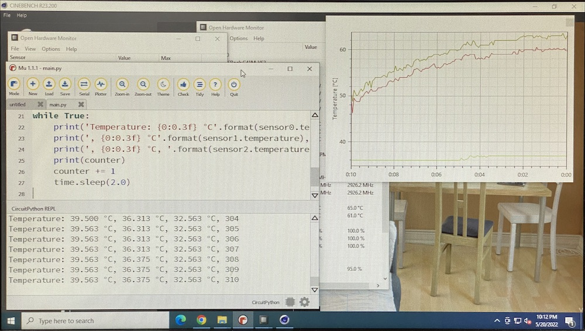

# Heatpipe - Investivation at SSIS

For an EE a student investigated the thermal conductivity of heatpipes. The application was to effectively cool a CPU.

## Setup

We got a used E6600 CPU with supposed 65W from 2006 on a G41 mainboard as heatsource and controlcenter.

## Software

The temperatures were measured directly with the CPU and integrated temperature sensors, using [OpenHardwareMonitor](https://openhardwaremonitor.org/downloads/) and the integrated log feature.

External temperatures on the heatpipes were measured with an Adafruit Metro M0 and three 18B20 1wire temperature sensors. The code is the following:

``` py
# Measuring temperature with DS18B20 - 2022-05-20

import time
import board
from adafruit_onewire.bus import OneWireBus

counter = 0
ow_bus = OneWireBus(board.D2)

devices = ow_bus.scan()
for device in devices:
    print("ROM = {} \tFamily = 0x{:02x}".format([hex(i) for i in device.rom], device.family_code))

import adafruit_ds18x20


sensor0 = adafruit_ds18x20.DS18X20(ow_bus, devices[0])
sensor1 = adafruit_ds18x20.DS18X20(ow_bus, devices[1])
sensor2 = adafruit_ds18x20.DS18X20(ow_bus, devices[2])

while True:
    print('Temperature: {0:0.3f} °C'.format(sensor0.temperature),end='')
    print(', {0:0.3f} °C'.format(sensor1.temperature),end='')
    print(', {0:0.3f} °C, '.format(sensor2.temperature),end='')
    print(counter)
    counter += 1
    time.sleep(2.0)
```

## Results

With Cinebench 23 on loop the internal two temperature sensors were measured with OpenSensor and plottet, while the Adafruit Metro Express M0 transmitted the temperature data of the 3 sensors to MU, running on the PC:



